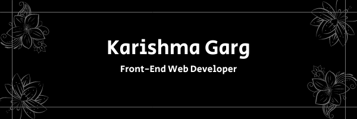

<!--
**Krrish105/Krrish105** is a ✨ _special_ ✨ repository because its `README.md` (this file) appears on your GitHub profile.

Here are some ideas to get you started:

- 🔭 I’m currently working on ...
- 🌱 I’m currently learning ...
- 👯 I’m looking to collaborate on ...
- 🤔 I’m looking for help with ...
- 💬 Ask me about ...
- 📫 How to reach me: ...
- 😄 Pronouns: ...
- ⚡ Fun fact: ...
-->

# Hello 👋

Hi, I am Karishma Garg, a self-taught Front-End Web Developer. I believe in building websites to solve problems, help people and that the power of Web should be accessible to everyone. 

## 🌱 Skills

Here are the programming languages I code in:

-  HTML
-  CSS
-  JavaScript
-  React.js

## &#x1f4c8; GitHub Stats

- 

## 📫 How to reach me:

Feel free to connect with me for any project, question, etc. on: 

-  Mail
-  Twitter
-  LinkedIn
